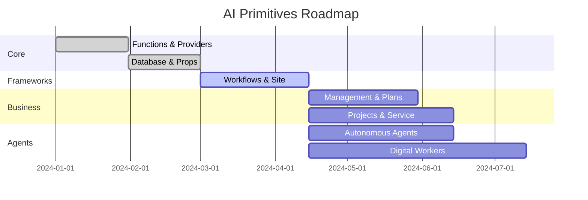

# Roadmap

This document outlines the planned evolution of the **AI Primitives** monorepo.

## Phases

1. **Core Primitives** – establish fundamental packages such as `ai-functions`, `ai-providers`, `ai-props`, and `ai-database`.
2. **Frameworks** – build higher level frameworks like `ai-workflows` and `ai-site` for creating complete applications.
3. **Business Logic** – provide planning and management tools (`ai-management`, `ai-plans`, `ai-projects`) for real-world use.
4. **Agents and Workers** – deliver autonomous agents and digital worker packages to automate tasks.
5. **Ecosystem** – continue refining packages and expanding documentation.

