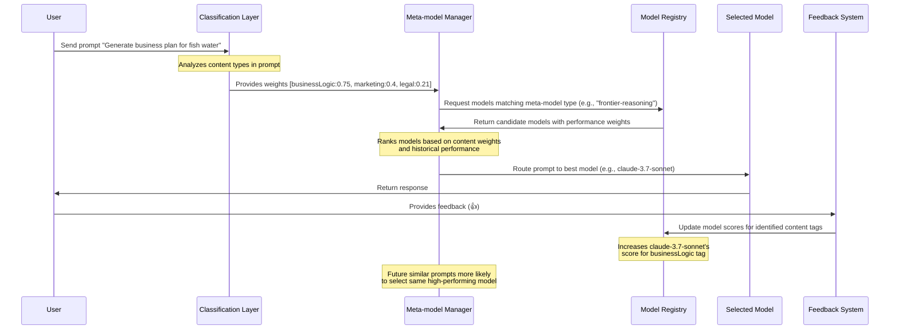

# ai-models

Utilities and Tools for the AI SDK, Functions, Workflows, Observability, and Evals

open questions:

    We need to support provider/creator/model
    Do we need or want a @ sign?
    Do we also support a creator/model syntax without provider? I think probably
    I think we should follow/embrace openrouter's syntax wherever possible - extending it though to add our requirements
    Do we also have our own version of openrouter/auto, openrouter/auto:online
        Can we tie the routing into the contents of the message and/or priority? (like performance, latency, throughput, cost, etc?)
    How do we handle reasoning? Follow the :reasoning flag from openrouter?
    Many new open models do not initially support tools or structured output, as that requires a lot of work by the hosting provider to make that function ... do we want a composite type tool that could use a fast/cheap model like gemini-2-flash-lite or 4o-mini to transform the output of the first model into the specified structured output?
    How do we want to handle other capabilities/tools?
    Should we route :online to native search models like gemini, perplexity, or the new 4o-search? or do we just follow the OpenRouter convention of injecting the Search results into the context window before calling?
    Do we want to support more general purpose tools? (like https://agentic.so/intro)
    How can we also support our own secure code execution tool (JS not python like Google / OAI)

Clearly we will need to phase and iterate ... but we have to think very carefully because once we start using the API across multiple projects, it's going to be hard to change

@{provider}/{creator}/{model}:{config,capabilities,tools,priorities}

{creator}/{model}:{config,capabilities,tools,priorities}
?model=deepseek-ai/deepseek-r1-distill-qwen-32b

?model=@openai/openai/gpt-4o-search-preview

?model=openai/gpt-4o:code,online

@openrouter/deepseek-ai/deepseek-r1-distill-qwen-32b
@cloudflare/deepseek-ai/deepseek-r1-distill-qwen-32b
@google-vertex/deepseek-ai/deepseek-r1-distill-qwen-32b
@google-ai-studio/anthropic/claude-3.7-sonnet:thinking
@google-vertex/anthropic/claude-3.7-sonnet:thinking
@open-router/anthropic/claude-3.7-sonnet:thinking-low,online,nitro

Use Cases:

    Evals - we need to easily and dynamically/programmatically change models, settings, tools, configuration, and mode
    (for example - we need to test if something does better with or without reasoning ... and within reasoning, we need low, medium, and high models ... We also in some cases must force structured outputs to be structured outputs, because if tool use is required, say by an anthropic model, that supports structured outputs via tools, then that is incompatible ... but also, there are essentially 4 different ways to get Objects that match a certain schema:
        structured_output: the best by far, but very limited support ... I think only 3 providers support this today
        tool_use: There is support for many more providers with tool use, but only a subset actually enforces guaranteed schema ... but also has limitations on number of tools and forced tool to use
        response_format: Supported on a majority of providers and models - but not universal - this guarantees valid JSON responses, but not any guarantee about the schema. This JSON mode can also be used without a schema to just force the model to respond in a structured data form vs normal text/markdown
        system prompt: If the model/provider does not support any of the first 3, then you can just ask nicely ... but depending on the model, this will fail 10-50% of the time
    Experimentation - Humans or LLM-as-Judge can pick the preferred response from 2 or more models (ie. compare 4o, o2, 3.7, 3.7:reasoning, flash 2, flash 2.0 reasoning
    Specify best model - no cost/price requirements ... 4.5, o1-high, o3-mini-high, r1, 3.7, 3.7:reasoning-high, Flash 2 Pro, Flash 2 Reasoning
    Specify only reasoning:
    at runtime, be able to tweak provider/model/settings/tools via a simple query param for example ... ?model=*:reasoning+code would route that to any and all models with reasoning and a code execution tool ... currently adding tool, changing config, etc requires code changes ... we need all of these variables to be tweaked/edited/stored/evaluated at runtime without code changes
    also we need to opt in/out of caching (and maybe even logging req/res bodies in sensitive PII situations)
    also probably seed ...

## Usage

Examples:

```ts
// The name of the exported function should be changed, I just wanted to get the ball rolling
import { getSupportedModel } from '@drivly/ai-utils'

const model = getSupportedModel('@openai/openai/gpt-4o:code,online')
const model = getSupportedModel('@anthropic/anthropic/claude-3.7-sonnet:thinking,code,online')
const model = getSupportedModel([
  // Fallback support if a certain model is down / doesnt have the full capabilities supported
  req.args.model, // Attempt to use the model from the request, otherwise fallback to the next one
  '@openai/openai/gpt-4o:code,online,thinking',
  '@anthropic/anthropic/claude-3.7-sonnet:thinking,code,online',
])
```

# Meta-model Manager

To support complex busines requirements, we need a system that can automatically determine the best model for each task.

### Classification of content

A classification layer will be used to attach weights based on the prompt. The weights indicate the relative importance of each type of content in the prompt:

`'Generate a business plan to sell water to a fish.'` -> `[ 'businessLogic:0.5', 'marketing:0.4', 'legal:0.21' ]`

Each model in our system will maintain a unique set of performance weights, calculated from multiple feedback sources including the Arena as well as direct user-provided Eval Feedback. The classification layer's primary responsibility is to identify and tag content types within prompts.

When users indicate their satisfaction with a model's response through positive feedback (such as giving a `👍`), our system automatically increases that model's score for the identified content tags. This scoring mechanism creates a self-improving selection algorithm that learns which models excel at specific content types over time, leading to increasingly accurate model selection for future similar prompts without requiring manual intervention.

The key difference between this and systems such as NotDiamond is that we can offer multiple meta-models, each with their own focuses and strengths. Another benefit that we offer is that our weights are changing daily as we receive more feedback.

### Ideas and thoughts

- One idea could be to slowly remove weights over time, marking models with less usage as less important. This would allow for newer models to quickly bubble up to the top without needing a vast evaluation dataset. For example, if Gemini 3 releases and people start using it more, the weights for Gemini 2 will slowly decrease, making it less and less likely to be chosen as we can more confident in the newer model.
- Tags could be generated from the prompt, making it fully dynamic. Works best if we force the classification model to try its best to match an existing tag, but create a new one if it cant.
- Version pinning.

### Examples

#### Meta model: frontier()

#### Prompt: Generate a business plan to sell water to a fish.

#### Weights: `[ 'businessLogic:0.75', 'marketing:0.4', 'legal:0.21' ]`

#### Models

Using the above information, we can now sort our models using the weights to find the best model within a certain "meta-model". In this example, we're using the `frontier-reasoning` group of models that are best at reasoning and logic.

Thanks to our classification layer, its extremely easy to route the prompt to `claude-3.7-sonnet`, which best matches the `businessLogic` tag (among others).

## Sequence diagram



`*:reasoning(sort:pricing,latency)`

## Examples

- Best PDF model thats the cheapest (gemini-2.0-flash) -> `*:pdf(sort:pricing)`
- PDF with reasoning (claude-3.7-sonnet) -> `*:pdf,reasoning`
- Creative writing (gpt-4.5) -> `creative`
- Extremely complex code debugging (o1-pro)
- Cheap blog post writer (gemini-2.0-flash)
- Better blog post writer (gpt-4o || claude-3.7-sonnet)
- Best blog post writer (gpt-4.5)
- Deal review (o3-mini || claude-3.7-sonnet || gemini-2.5-pro)

#### Example business requirements

```
Requirements: Must be good at creative writing, but cost less than $15 per million tokens
Constraints: Must be able to handle complex code
```

We need to transform the above business requirements into a meta-model:

```
[
    "gemini-2.0-flash",
    ...
]
```

From the list, we can then sort by pricing, latency, and other constraints at completion time depending on the users goals.
